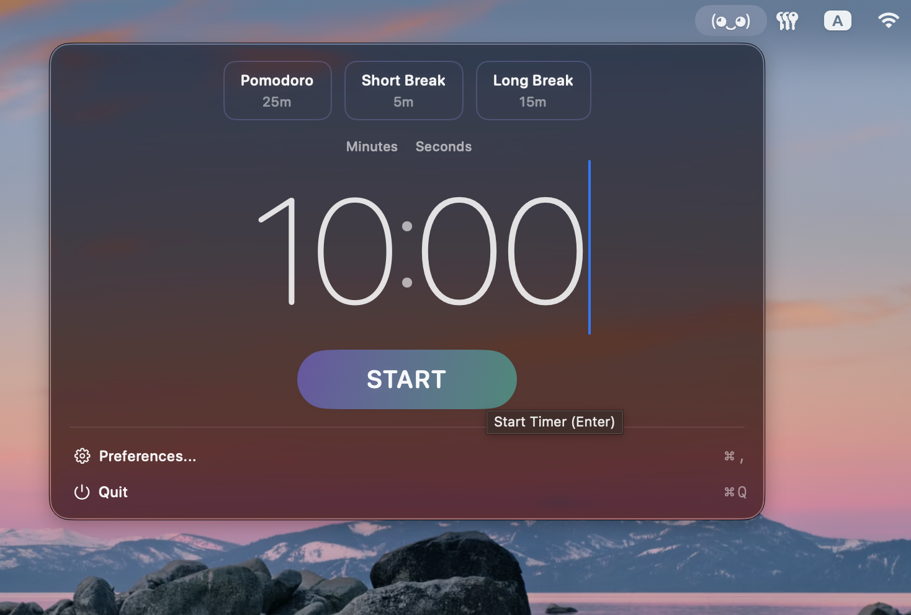
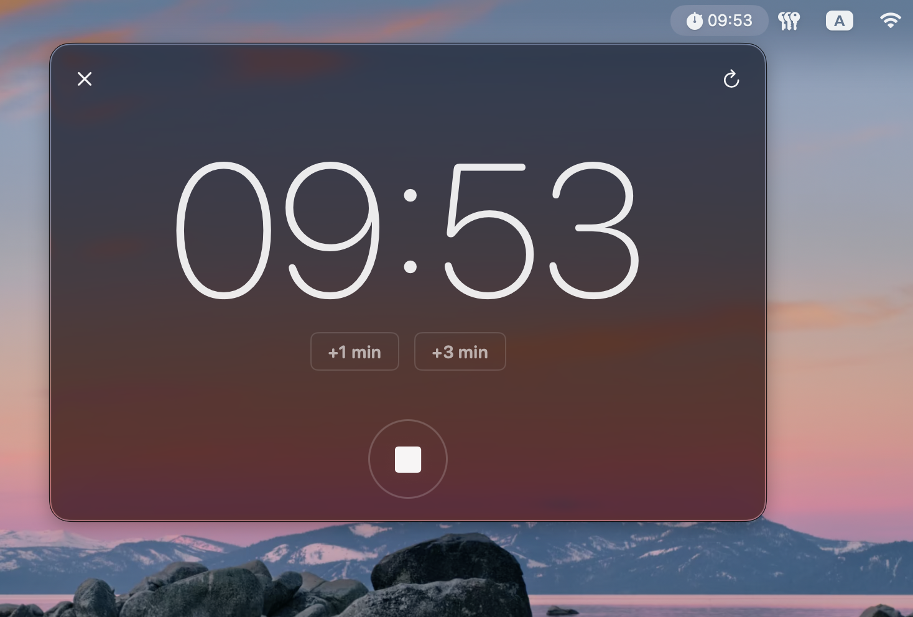
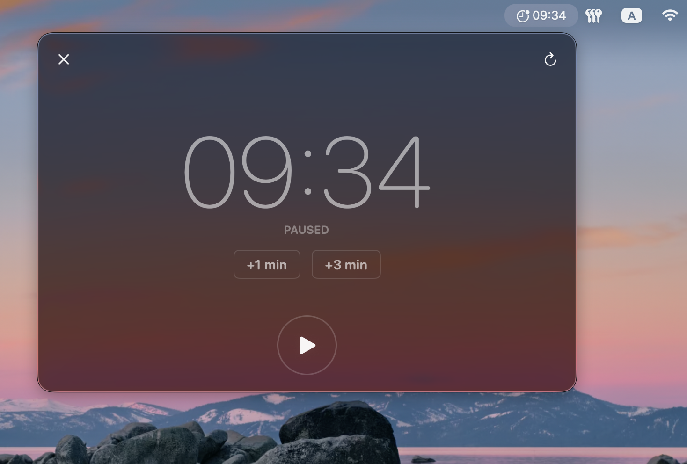
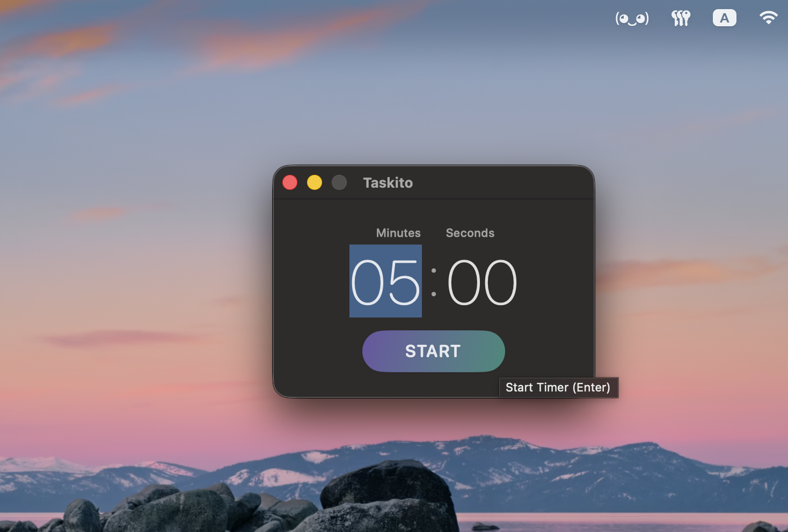

<p align="center">
 <br>
   
    <br> <br>
</p>

# Taskito

A tiny macOS menu bar timer that helps you stay focused and finish your tasks.

Simple, fast, and distraction-free. No forced workflows, no tracking, no cloud sync. Just a timer that lives quietly in your menu bar until you need it.

<p align="center">
  <br>
  <sub>Enter timer duration</sub>
</p>
<br>

<p align="center">
  <br>
  <sub>Active countdown in window and menu bar</sub>
</p>
<br>

<p align="center">
  <br>
  <sub>Timer continues in menu bar</sub>
</p>
<br>

<p align="center">
  <br>
  <sub>Pause timer anytime</sub>
</p>
<br>

<p align="center">
  <br>
  <sub>Quick start from anywhere with keyboard shortcut</sub>
</p>
<br>

## Features

- ⏱️ **Simple countdown timer** - Set any duration, no forced Pomodoro technique.
- 📍 **Menu bar only** - No Dock icon, no distractions.
- ⚡ **Zero setup** - Fast and lightweight, works immediately.
- ⌨️ **Keyboard-first** - Full keyboard support with global shortcuts.
- 🎯 **Preset timers** - Save up to 5 frequently-used durations. Access with ⌘1-⌘5.
- ⏯️ **Timer controls** - Space to play/pause, ⌘R to restart, ⌃C to cancel.
- ➕ **Add time on the fly** - + for 1 minute, Shift + for 3 minutes
- 🔒 **Privacy-focused** - All data stays on your Mac, no cloud, no tracking.
- 🔕 **Optional sound** - Audio notification when timer completes.
- 🚀 **Launch on startup** - Optionally start with macOS.

## System Requirements

- macOS 14.2 or later
- Apple Silicon or Intel Mac

## Installation

1. **Download** the latest release from the [releases page](https://github.com/libekonst/Taskito/releases)
2. **Mount the DMG** and drag Taskito to your Applications folder
3. **Remove the quarantine flag** by opening Terminal and running:

   ```bash
   xattr -cr /Applications/Taskito.app
   ```

4. **Launch Taskito** from your Applications folder

> **Note:** If you see "Taskito is damaged and can't be opened", you skipped step 3. The app isn't actually damaged—this is macOS Gatekeeper blocking unsigned apps. Run the command above to fix it.

### Why the "damaged" Error?

**The app isn't actually damaged** - this is macOS Gatekeeper blocking unsigned apps.

macOS has three security levels:

1. **App Store apps** - No warnings
2. **Notarized apps** (signed + approved by Apple) - One-time approval dialog
3. **Unsigned apps** (this app) - Blocked with misleading "damaged" error

When you download files from the internet, macOS adds a "quarantine" flag. The `xattr -cr` command removes this flag, allowing the unsigned app to run.

**About the xattr command:**

- `-c` clears all extended attributes (including quarantine)
- `-r` applies recursively to the entire app bundle

## Usage

### Starting a Timer

**From the Menu Bar:**

1. Click the Taskito icon in your menu bar
2. Enter minutes and seconds (or click a preset button)
3. Press Enter or click START

**With Global Shortcut:**

1. Press your configured global shortcut (default: unset, configure in Settings)
2. Opens Quick Timer window from anywhere
3. Enter duration and press Enter

### Managing Running Timers

- **Play/Pause** - Space bar or click the play/pause button
- **Add Time** - Press `+` for 1 minute, `Shift +` for 3 minutes
- **Restart** - `⌘R` to restart from original duration
- **Cancel** - `⌃C` or click the X button

### Preset Timers

Save frequently-used durations in Settings:

- Maximum 5 presets
- Access with `⌘1` through `⌘5`
- Click to start immediately

## Keyboard Shortcuts

### Global (System-Wide)

| Shortcut                 | Action                          |
| ------------------------ | ------------------------------- |
| Custom (set in Settings) | Open Taskito Quick Timer window |

### Timer Setup

| Shortcut    | Action                             |
| ----------- | ---------------------------------- |
| `⌘1` - `⌘5` | Start preset timer (if configured) |
| `Enter`     | Start timer with current values    |

### Active Timer

| Shortcut  | Action           |
| --------- | ---------------- |
| `Space`   | Play/Pause timer |
| `+`       | Add 1 minute     |
| `Shift +` | Add 3 minutes    |
| `⌘R`      | Restart timer    |
| `⌃C`      | Cancel timer     |

See the full shortcuts reference in the app's Settings window.

## Settings

Access settings by clicking the gear icon in the menu bar interface:

- **Start on system startup** - Launch Taskito automatically when you log in
- **Play sound when timer completes** - Audio notification when countdown reaches zero
- **Enable global shortcut** - Toggle system-wide keyboard shortcut on/off
- **Customize shortcut** - Set your preferred global keyboard combination
- **Preset timers** - Configure up to 5 quick-access timer durations

## Credits

Taskito uses [KeyboardShortcuts](https://github.com/sindresorhus/KeyboardShortcuts) by [Sindre Sorhus](https://github.com/sindresorhus) for global keyboard shortcut registration.
